## Laboratorio #4 – REST API Blueprints Con Stomps (Java 21 / Spring Boot 3.3.x)
# Escuela Colombiana de Ingeniería – Arquitecturas de Software  

---

## 📋 Requisitos
- Java 21
- Maven 3.9+

### Instalación
---

1. Clonar el repositorio a la maquina local:
   ```bash
    git clone <URL_DEL_REPOSITORIO>
    ```
2. Navegar al directorio del repositorio
    ```bash
    cd <NOMBRE_DEL_PROYECTO>
    ```

## ▶️ Ejecución del proyecto
```bash
mvn clean install
En local correr docker compose up -d
mvn spring-boot:run
Para ver la base de datos `docker exec -it postgres-db psql -U julian -d baseDeDatos`
```
Probar con `curl`:
```bash
curl -s http://localhost:8080/api/v1/blueprints
curl -s http://localhost:8080/api/v1/blueprints/john
curl -s http://localhost:8080/api/v1/blueprints/john/house 
curl -i -X POST http://localhost:8080/api/v1/blueprints -H 'Content-Type: application/json' -d '{ "author":"john","name":"kitchen","points":[{"x":1,"y":1},{"x":2,"y":2}] }'
curl -i -X PUT  http://localhost:8080/api/v1/blueprints/john/kitchen/points -H 'Content-Type: application/json' -d '{ "x":3,"y":3 }'
```
#### Pruebas curl en bash

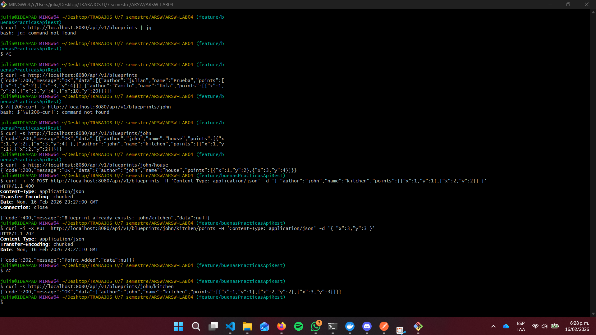

> Si deseas activar filtros de puntos (reducción de redundancia, *undersampling*, etc.), implementa nuevas clases que implementen `BlueprintsFilter` y cámbialas por `IdentityFilter` con `@Primary` o usando configuración de Spring.
---

Abrir en navegador:  
- Swagger UI: [http://localhost:8080/swagger-ui.html](http://localhost:8080/swagger-ui.html)
#### Evidencia Swagger UI

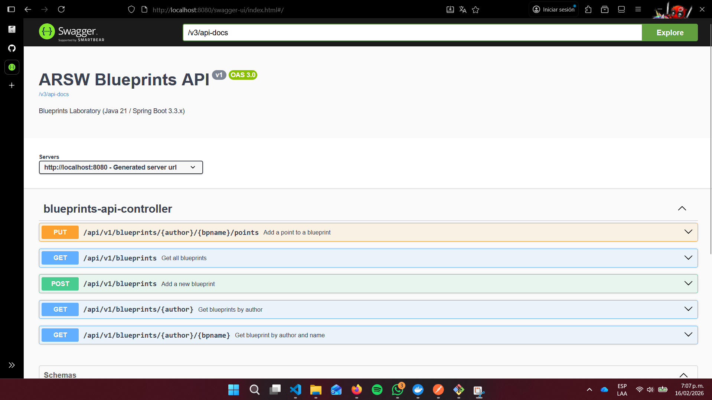
---

### Implementacion @ApiResponse

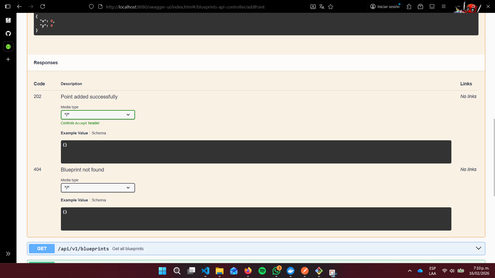

- OpenAPI JSON: [http://localhost:8080/v3/api-docs](http://localhost:8080/v3/api-docs)  
### Evidencia Api-docs

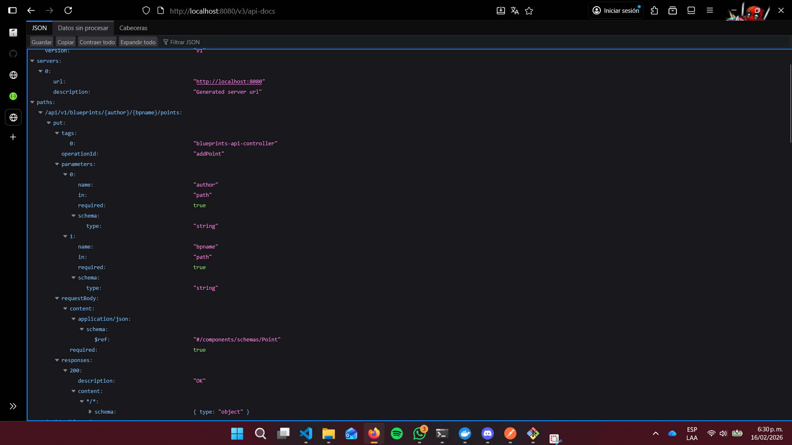

---

## 🗂️ Estructura de carpetas (arquitectura)

```
src/main/java/edu/eci/arsw/blueprints
  ├── model/         # Entidades de dominio: Blueprint, Point
  ├── persistence/   # Interfaz + repositorios (InMemory, Postgres)
  │    └── impl/     # Implementaciones concretas
  ├── services/      # Lógica de negocio y orquestación
  ├── filters/       # Filtros de procesamiento (Identity, Redundancy, Undersampling)
  ├── controllers/   # REST Controllers (BlueprintsAPIController)
  └── config/        # Configuración (Swagger/OpenAPI, etc.)
  └── dto/           # Implementacion ApiResponseRecord
  └── exception/     # Separa de la capa de persistencia las excepciones usadas por el sistema


```

> Esta separación sigue el patrón **capas lógicas** (modelo, persistencia, servicios, controladores), facilitando la extensión hacia nuevas tecnologías o fuentes de datos.

---

## 📖 Actividades del laboratorio

### 1. Familiarización con el código base
- Revisa el paquete `model` con las clases `Blueprint` y `Point`.  
Point usa record que es para modelar datos inmutables con una sintaxis muy concisa, eliminando código repetitivo

- Entiende la capa `persistence` con `InMemoryBlueprintPersistence`.
Lo que hace esta capa es guardar los blueprintsen un Map dentro de la aplicación, sin una base de datos `:(`

- Analiza la capa `services` (`BlueprintsServices`) y el controlador `BlueprintsAPIController`.
La capa services y los controladores tienen como principal funcion añadir blueprints, point y unos metodos get para consultar o conseguir todos los blueprints que existen, filtrarlos por autor y por ultimo por blueprint y por autor

### 2. Migración a persistencia en PostgreSQL
- Configura una base de datos PostgreSQL (puedes usar Docker).  
- Implementa un nuevo repositorio `PostgresBlueprintPersistence` que reemplace la versión en memoria.  
- Mantén el contrato de la interfaz `BlueprintPersistence`.

#### Implementación PostgreSQL Evidencia Docker 
Mediante El archivo docker-compose.yml se realiza la configuracion con la cual se va a ejectutar la aplicación,
donde dentro esta la base de datos

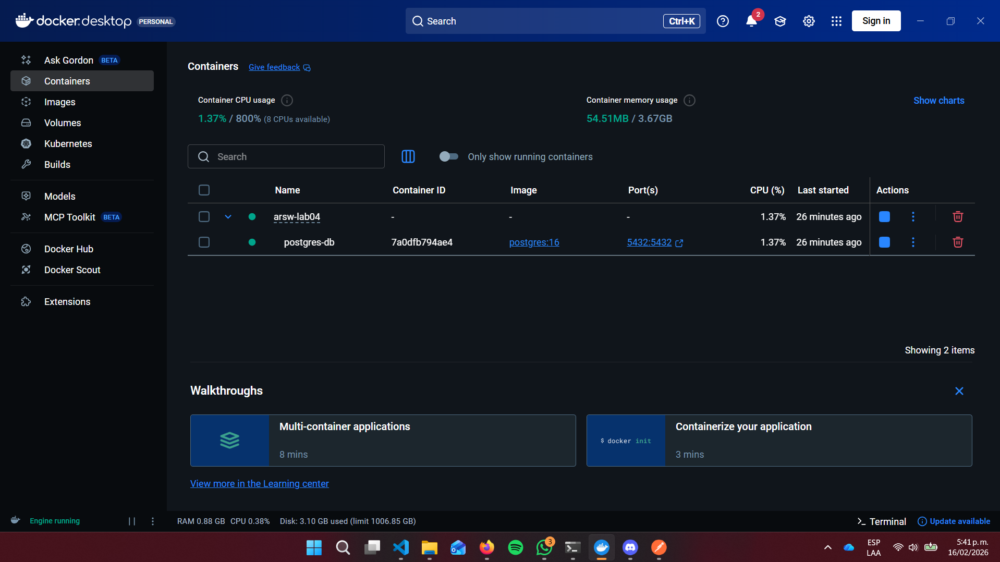
---

#### Implementación PostgreSQL Evidencia PostMan
Se realiza un post en http://localhost:8080/blueprints con una prueba el cual es exitoso

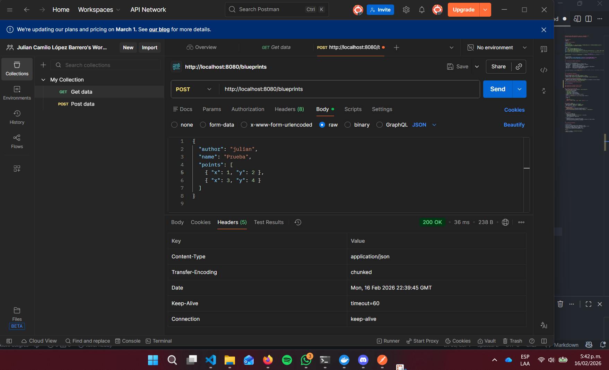
--- 

#### Implementación PostgreSQL Evidencia Query
Se hace un SELECT * FROM blueprints; y se puede observar que los resultados son correctos

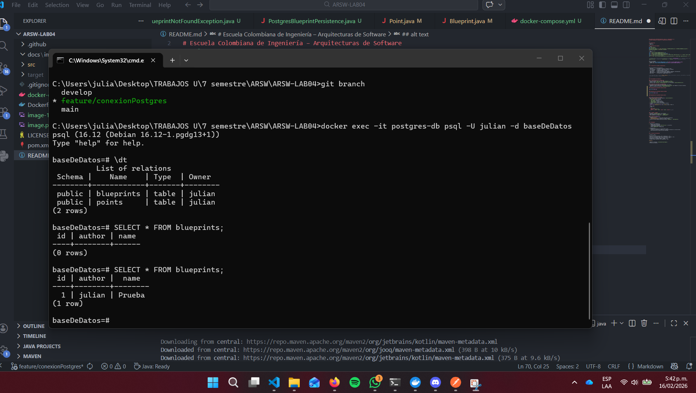
---

### 3. Buenas prácticas de API REST
- Cambia el path base de los controladores a `/api/v1/blueprints`.  
- Usa **códigos HTTP** correctos:  
  - `200 OK` (consultas exitosas).  
  - `201 Created` (creación).  
  - `202 Accepted` (actualizaciones).  
  - `400 Bad Request` (datos inválidos).  
  - `404 Not Found` (recurso inexistente).  
- Implementa una clase genérica de respuesta uniforme:
  ```java
  public record ApiResponse<T>(int code, String message, T data) {}
  ```
  Ejemplo JSON:
  ```json
  {
    "code": 200,
    "message": "execute ok",
    "data": { "author": "john", "name": "house", "points": [...] }
  }
  ```

#### Pruebas de ejecución 
POST para añadir un blueprint 

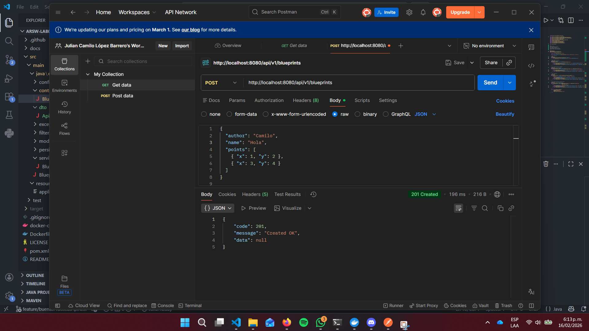
---
GET para verificar que haya sido añadido y ver los mensajes de la respuesta

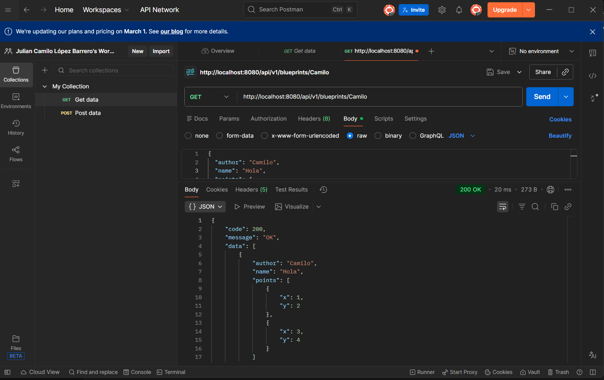
---

PUT para añadir points al anteriormente creado

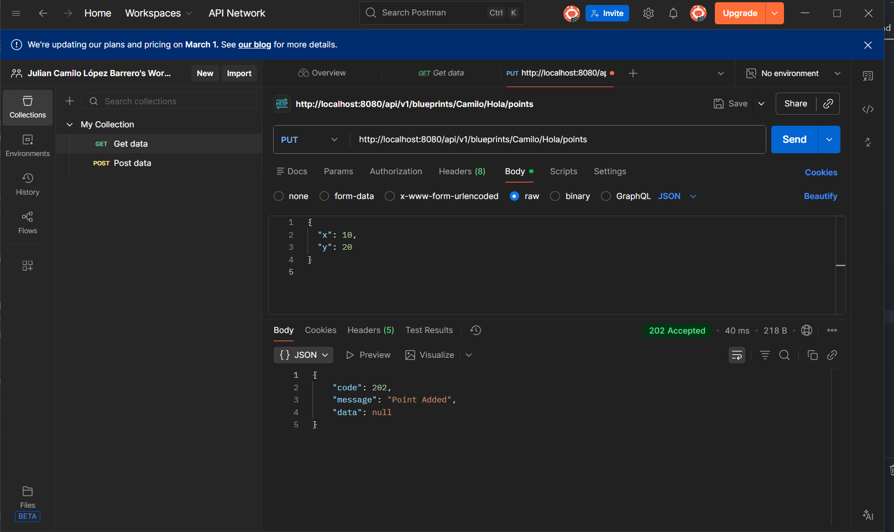
---

Verificacion en la base de datos 

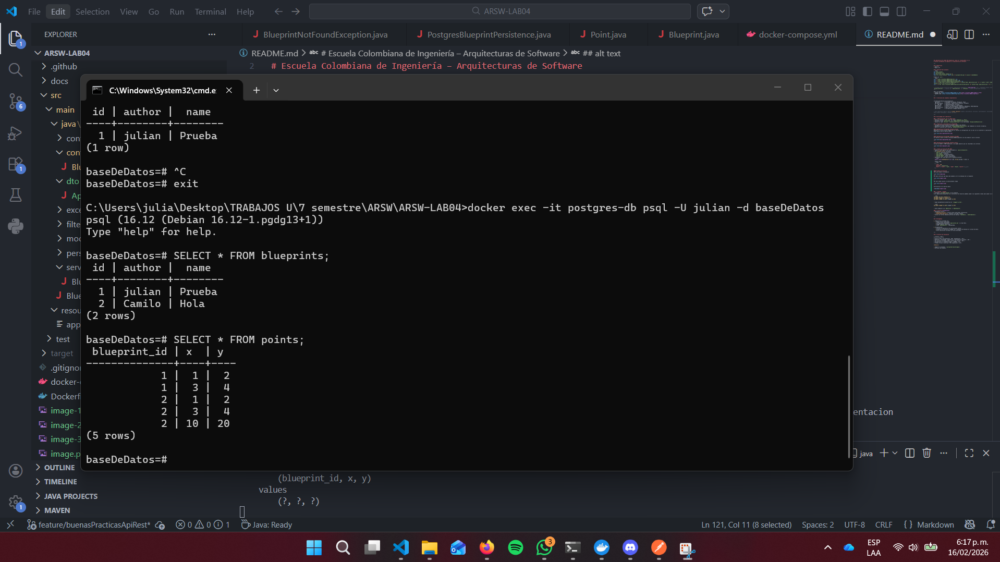

### 4. OpenAPI / Swagger
- Configura `springdoc-openapi` en el proyecto.
En el application.properties en el directorio de resources podemos añadir las siguientes lineas para añadir la documentacion

```java
springdoc.api-docs.enabled=true
springdoc.swagger-ui.enabled=true
springdoc.swagger-ui.path=/swagger-ui.html
```

- Expón documentación automática en `/swagger-ui.html`. 

```java
springdoc.swagger-ui.path=/swagger-ui.html
```

- Anota endpoints con `@Operation` y `@ApiResponse`.


### 5. Tiempo real con STOMP / WebSocket

Se integró soporte de comunicación en tiempo real usando **STOMP sobre WebSocket**, permitiendo que múltiples clientes colaboren en el mismo blueprint de forma sincronizada.

#### Dependencia añadida (`pom.xml`)
```xml
<dependency>
    <groupId>org.springframework.boot</groupId>
    <artifactId>spring-boot-starter-websocket</artifactId>
</dependency>
```

#### Configuración – `WebSocketConfig`
- Anotada con `@EnableWebSocketMessageBroker`.
- Endpoint de conexión WebSocket: **`/ws-blueprints`** (acepta cualquier origen).
- Broker en memoria habilitado para los destinos **`/topic`** y **`/queue`**.
- Prefijo de aplicación: **`/app`** (rutas hacia los `@MessageMapping`).
- Prefijo de usuario: **`/user`**.

```java
registry.addEndpoint("/ws-blueprints").setAllowedOriginPatterns("*");
registry.enableSimpleBroker("/topic", "/queue");
registry.setApplicationDestinationPrefixes("/app");
```

#### Controlador WebSocket – `BluePrintWebSocketController`
Maneja mensajes STOMP entrantes en **`/app/draw`**:

1. Recibe un `DrawEvent` con `author`, `name` y el nuevo `Point`.
2. Persiste el punto llamando a `services.addPoint(...)`.
3. Recupera el blueprint actualizado y lo difunde a todos los suscriptores de **`/topic/blueprints.{author}.{name}`**.

```java
@MessageMapping("/draw")
public void onDraw(DrawEvent evt) {
    services.addPoint(evt.author(), evt.name(), evt.point().x(), evt.point().y());
    Blueprint updatedBp = services.getBlueprint(evt.author(), evt.name());
    template.convertAndSend("/topic/blueprints." + evt.author() + "." + evt.name(), updatedBp);
}
```

#### DTOs STOMP

| DTO | Dirección | Campos |
|-----|-----------|--------|
| `DrawEvent` | Cliente → Servidor (`/app/draw`) | `author`, `name`, `point` |
| `BluePrintUpdate` | Servidor → Clientes (`/topic/blueprints.*`) | `author`, `name`, `points` |

#### CORS – `CorsConfig`
Para permitir la conexión desde el frontend (Vite en `http://localhost:5173`) se configuró:
```java
registry.addMapping("/**")
        .allowedOrigins("http://localhost:5173")
        .allowedMethods("GET", "POST", "PUT", "DELETE", "OPTIONS")
        .allowedHeaders("*")
        .allowCredentials(true);
```

#### Flujo de uso desde un cliente
```
1. Conectar al endpoint WS:  ws://localhost:8080/ws-blueprints
2. Suscribirse a:            /topic/blueprints.{author}.{name}
3. Enviar puntos a:          /app/draw  →  { "author":"john","name":"house","point":{"x":5,"y":5} }
4. Recibir broadcast con el blueprint actualizado en el topic suscrito.
```

---

## Autor

* **Julian Camilo Lopez Barrero** - [JulianLopez11](https://github.com/JulianLopez11)